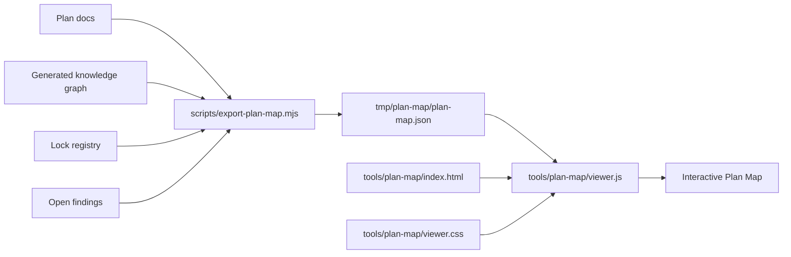

# Curvios Plan Map

Read-only dashboard for the implementation plan. The Plan Map is a human
navigation surface: it explains plan blocks, dependencies, collisions, health
signals, and start readiness without becoming a second source of truth.

## Schnellstart

From the repository root:

```powershell
.\start-plan-map.ps1
```

The launcher refreshes the export, starts a local static server, and opens the
viewer. If another server already uses the default port, the script selects the
next free port.

For export-only checks:

```bash
node scripts/export-plan-map.mjs
```

Default output:

```text
tmp/plan-map/plan-map.json
```

## Export

The export script creates the read-only JSON dataset consumed by the browser
viewer. It reads existing repo sources only:

```bash
node scripts/export-plan-map.mjs
```

Input sources:

- `docs/Umsetzungsplan.md`: compact master index and dependency table.
- `docs/plaene/aktiv/VXX.md`: canonical block details, DoD, risks,
  `scope_files`, phases, and explanatory sections.
- `docs/generated/knowledge-graph*.json`: impact, coverage, scorecard, graph
  health, and file relations.
- `docs/lock-status/_locks-registry.json`: current lock/readiness hints.
- `docs/prozess/Open_Findings.md`: open governance and verification findings.
- `docs/plaene/neu/`: intake drafts as a separate non-canonical layer.
- `docs/plaene/alt/`: read-only archive references and superseded intake index.

The generated dataset is intentionally temporary:

```text
tmp/plan-map/plan-map.json
```

Do not edit this file by hand. Re-run the export instead.

## Aufbau



Ownership boundaries:

- `scripts/export-plan-map.mjs` owns parsing and normalization.
- `tools/plan-map/index.html` owns the static viewer shell.
- `tools/plan-map/viewer.js` owns interaction, map layout, focus mode,
  filters, search, detail tabs, and panel state.
- `tools/plan-map/viewer.css` owns responsive layout, scroll behavior, visual
  layers, legend styling, and density.
- `start-plan-map.ps1` owns local startup, export refresh, and static serving.
- `tests/plan-map-export.contract.test.mjs` protects the exported JSON contract.

It does not write plan status, locks, graph files, or governance sources.

## Datenmodell

The viewer expects a single JSON document with these conceptual groups:

- `blocks`: plan blocks from the master and canonical active plan files.
- `dependencies` and `consumers`: directed plan relations for the map edges.
- `scope`: file-level scope, collisions, overlap, and impact hints.
- `graph`: knowledge-graph impact and health signals.
- `locks`: current lock/readiness information.
- `findings`: open findings relevant to plan execution.
- `intakePlans`: draft plans from `docs/plaene/neu/`, including
  classification, lane/action hints, primary and canonical block IDs,
  workstream hints, planned block IDs, target plan file, and `scope_files`
  where present.
- `archiveReferences`: lightweight read-only references from `docs/plaene/alt/`,
  including superseded intake drafts and archived VXX block files. These entries
  are historical context, not runnable plan nodes.
- `meta`: export timestamp, source paths, and version hints.
 
The UI treats missing optional fields as "unknown" and keeps the block visible.
Required contract changes belong in the export test before changing the viewer.

## Intake-Lanes

The intake layer is navigation only. It never writes to the master index, active
plans, locks, graph files, or draft files.

Plan Map groups `docs/plaene/neu/` into five lanes:

- `candidate` / Neue Ideen: no direct master match; default User-Intake review.
- `adopted-open` / Bereits geplant: the target block is already open or planned in the master; cards link to that canonical block.
- `adopted-done` / Erledigt / Archiv: the target block is already done; cards are archive candidates, but no move is automatic.
- `bot-training` / Bot-Training: protected special zone governed by `docs/bot-training/Bot_Trainingsplan.md`.
- `meta` / Meta: README or structure notes, not plan candidates.

The sidebar default is `Ideen + Handoff`, which shows new ideas plus adopted
handoff lanes and hides Bot-Training/Meta noise. Choosing `Alle Lanes` shows
the full raw intake layer.

Summary metrics split the intake count into `Ideen`, `Bereits geplant`,
`Archivkandidaten`, `Bot-Training`, and `Meta`. The older
`byIntakeClassification` field remains available for compatibility.

## Archiv-Kontext

Archive context stays out of the default decision view. Superseded intake drafts
from `docs/plaene/alt/superseded-intakes-2026-05/README.md` and direct archived
block files such as `docs/plaene/alt/V74.md` are exported as `archiveReferences`
with `archiveType`, `canonicalBlockId`, `archivePath`, `reason`, `sourceIndex`,
`readRule`, and workstream hints.

The viewer uses that layer in two quiet places:

- Canonical block details show a `Historie / Archiv` badge and expandable
  archive references when a historical entry points at the selected block.
- `Ideen / Intake` keeps the archive hidden by default. The `Archiv anzeigen`
  toggle reveals a separate read-only archive section for search and trace work.

Archive references do not contribute to readiness, dependency edges, scope
collisions, start recommendations, or normal intake counts.

## Views

- Map: dependency graph with focus mode, legend, layer toggles, readiness badges, edge tooltips, and block details.
- Ideen / Intake: draft-plan layer from `docs/plaene/neu/`, separated from
  canonical master blocks and filterable by lane/classification, workstream,
  search, and file focus.
- Kollisionen: clickable scope-collision matrix; file clicks focus the map on affected blocks.
- Health: graph score, coverage, active locks, and open findings.

## Detail Model

The right panel keeps dense data behind tabs:

- Ueberblick: start signal, progress, collisions, impact, source path.
- Erklaerung: short narrative, goals, implemented highlights, open next steps, and non-goals.
- Start: dependency/consumer context and the compact "Warum?" explanation.
- Scope: impact breakdown, shared files, scope files, and references.
- Phasen: current phase progress and phase list.
- Risiken: dependency, governance, package, finding, and verification hints.

Risk hints are rendered as compact dropdowns. The collapsed row keeps the risk
list scan-friendly; opening a row explains why the signal matters and which
gate or scope decision it normally affects. The same viewer is embedded by the
Electron Map Tools shell and by the Android wrapper.

## UI-Schichten

The map keeps dense information in layers so the first view remains readable:

- Left rail: search, status/priority/readiness filters, sorted block list.
- Center map: phases as columns, blocks as compact nodes, curved dependency and
  collision edges, hover/focus highlighting, and scrollable canvas.
- Right panel: one selected block with short summary first, then deeper tabs.
- Legend: visual vocabulary for node color, edge type, readiness, collision, and
  impact without repeating long text in the map.
- Explanation tab: longer implementation notes, goals, completed work, next
  steps, and non-goals behind one deliberate click.

The map area is scrollable by design. Wide graphs may extend beyond the initial
viewport; the shell keeps the side panels fixed while the canvas scrolls.

## Wissensgraph-Verankerung

The Plan Map is anchored in the knowledge graph by
`data/contracts/knowledge-graph/plan-map-tooling.v1.json`.

That mapping connects:

- the export runtime to the temporary Plan Map dataset,
- the viewer runtime to the dataset, HTML shell, CSS, and this README,
- the launcher to the viewer shell and generated dataset,
- the export runtime to its contract test,
- this documentation and mapping file as explicit graph config nodes.

Useful checks:

```bash
npm run graph:build
npm run graph:check
node scripts/query-knowledge-graph.mjs impact-for-file tools/plan-map/viewer.js --json
node scripts/query-knowledge-graph.mjs impact-for-file scripts/export-plan-map.mjs --json
```

The graph anchor is intentionally classified as repo tooling. It improves
discoverability and impact analysis, but it does not change active plan block
ownership or closure gates.

## Verification

Run these after changing the Plan Map structure:

```bash
node --test tests/plan-map-export.contract.test.mjs
npm run graph:build
npm run graph:check
npm run plan:check
```

For visual changes, also start the viewer and inspect desktop and narrow
browser widths:

```powershell
.\start-plan-map.ps1
```
